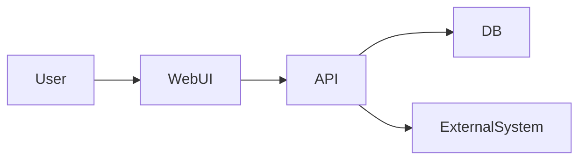

# GitHub Copilot で要件定義書を自動生成するためのセットアップ完全ガイド

このドキキュメントは、**GitHub Copilot（Chat / Plan / Agent モード）**を使って  
ソフトウェア開発の **要件定義書ドラフトの生成〜レビュー** を半自動化するための  
リポジトリ構成、ファイルテンプレート、設定方法、運用フローをまとめたものです。

---

## 0. 前提・想定環境

- エディタ: Visual Studio Code（最新版）
- 拡張機能: GitHub Copilot / GitHub Copilot Chat
- ライセンス: GitHub Copilot Pro 以上
- リポジトリ: 要件定義書のテンプレートとプロジェクト情報を含む任意のリポジトリ

---

## 1. ゴール

1. リポジトリに **要件定義書テンプレート** と **プロジェクト情報 (YAML)** を配置する
2. `.github/copilot-instructions.md` に Copilot の動作ルールを定義する
3. Chat / Plan モードに次のように依頼するだけで作業が回る状態にする
   - 「要件定義書ドラフトを生成して」
   - 「要件定義書をレビューして改善提案を出して」
4. 生成物は `docs/requirements/` 配下に Markdown として出力される

---

## 2. ディレクトリ構成

```text
.
├─ .github/
│   ├─ copilot-instructions.md
│   └─ copilot-instructions.requirements.md   # （任意）
├─ templates/
│   └─ requirements_template.md
├─ inputs/
│   └─ project_info.yaml
├─ docs/
│   └─ requirements/
│       ├─ <project>-requirements.md
│       └─ <project>-requirements-review.md
└─ docs/
    └─ requirements-setup-guide.md
```

---

## 3. 各ファイルのテンプレート

---

### 3.1 `templates/requirements_template.md`

```markdown
# 要件定義書 - {{project_name}}

## 1. 文書情報
- 作成日: {{created_at}}
- 作成者: {{author}}
- バージョン: {{version}}
- 関連ドキュメント: {{related_docs}}

## 2. プロジェクト概要
- プロジェクト名: {{project_name}}
- 背景・目的:
  - {{background}}
  - {{purpose}}
- スコープ概要:
  - {{scope_summary}}

## 3. 用語定義
- 必要に応じて用語と略語を列挙  
  - 例）在庫回転率: TBD

## 4. ステークホルダー
| 区分 | 部署／ロール | 主な関心事       | 決裁権限 |
| ---- | ------------ | ---------------- | -------- |
| 例   | 情シス       | システム安定稼働 | 中       |
| TBD  | TBD          | TBD              | TBD      |

## 5. システム概要
- 全体像の説明（1〜3 行）
- 主な機能ブロック



## 6. 機能要件

### 6.1 機能一覧

| ID    | 機能名           | 概要                           | 優先度(Must/Should/Could) |
| ----- | ---------------- | ------------------------------ | ------------------------- |
| F-001 | 在庫一覧参照     | 倉庫別・品目別に在庫一覧を表示 | Must                      |
| F-002 | 在庫アラート通知 | 閾値を下回った在庫を通知       | Should                    |
| TBD   | TBD              | TBD                            | TBD                       |

### 6.2 ユースケース / 画面フロー

* ユースケースを箇条書き、またはシーケンス図で記載

## 7. 非機能要件

### 7.1 性能・スケーラビリティ

* 例）通常時: 95% のリクエストが 3 秒以内に応答すること。
* TBD

### 7.2 可用性

* 稼働時間・メンテナンス方針など

### 7.3 セキュリティ

* 認証・認可・ログ

### 7.4 運用・保守

* 監視項目やアラート条件など

## 8. 制約条件

* 技術的制約、組織・体制の制約、予算・納期など

## 9. リスクと前提条件

### 9.1 前提条件

* 例）既存マスタデータがクレンジング済みであること
* TBD

### 9.2 リスク一覧

| No  | リスク内容           | 影響度 | 発生確率 | 対応方針       |
| --- | -------------------- | ------ | -------- | -------------- |
| 1   | IoT デバイス納期遅延 | 高     | 中       | 代替機種の検討 |
| TBD | TBD                  | TBD    | TBD      | TBD            |

## 10. As-Is / To-Be / Gap / 対応策

| 観点             | As-Is（現状）   | To-Be（あるべき姿） | Gap（乖離） | 対応策         |
| ---------------- | --------------- | ------------------- | ----------- | -------------- |
| 例：在庫管理業務 | 手動 Excel 集計 | 自動集計            | 工数・精度  | 自動化機能導入 |

## 11. 未確定事項・要確認事項

* 未確定事項:

  * TBD
* 要確認事項（質問リスト）:

  * TBD

```

---

### 3.2 `inputs/project_info.yaml`

```yaml
project_name: "在庫最適化プラットフォーム"
created_at: "2025-11-17"
author: "チーム・ドラゴン"
version: "v0.1"
related_docs:
  - "企画書_在庫最適化PJ_v1.0.docx"

background: >
  倉庫ごとに在庫が過剰・不足するケースが増加しており、
  在庫コストの増加と欠品リスクが問題になっている。

purpose: >
  在庫の見える化と需要予測に基づく適正在庫量の算定により、
  在庫コストを削減しつつ欠品を防止する。

scope_summary: >
  在庫データの集約・分析、需要予測、発注案の提示を対象とし、
  物流実行システムの刷新は含めない。

stakeholders:
  - role: "物流部門担当者"
    interest: "在庫の適正化、欠品防止"
  - role: "情報システム部"
    interest: "安定稼働、既存システムとの連携"
  - role: "経営層"
    interest: "在庫コスト削減、KPI 可視化"

functional_requirements:
  - id: "F-001"
    name: "在庫一覧参照"
    description: "倉庫別・品目別に在庫一覧を表示する"
    priority: "Must"

  - id: "F-002"
    name: "在庫アラート通知"
    description: "閾値を下回った在庫を通知する"
    priority: "Should"

non_functional_requirements:
  performance:
    - "通常時、95%のリクエストが3秒以内に応答すること"
  availability:
    - "月間稼働率 99.9% 以上"
  security:
    - "社内セキュリティポリシーに準拠すること"
  operations:
    - "主要イベントの監視とアラートが可能であること"

constraints:
  - "クラウドは Azure を利用する"
  - "開発言語は C# / TypeScript を基本とする"
  - "納期は 2026-03-31 まで"

risks:
  - "IoT デバイス供給遅延"
  - "既存システム側仕様変更の影響"
```

---

### 3.3 `.github/copilot-instructions.md`

```markdown
# GitHub Copilot Repository Instructions

このリポジトリでは GitHub Copilot を使って  
**ソフトウェア開発の要件定義書を自動生成・レビュー**します。

---

## 共通ポリシー

- ドキュメントは **日本語 / Markdown形式** とする
- 生成先は `docs/requirements/` 配下とする
- `templates/requirements_template.md` の章立ては絶対に崩さないこと
- 不足情報は推測せず、次のいずれかに列挙する
  - 「前提条件」
  - 「未確定事項」
  - 「要確認事項（質問リスト）」

---

## 要件定義書生成ルール

- 入力は必ず以下を使用する  
  - `inputs/project_info.yaml`  
  - `templates/requirements_template.md`
- 出力ファイル名  
  - `docs/requirements/{{project_name}}-requirements.md`
- 生成物には Mermeid、表、箇条書きを適宜使用する

---

## 要件定義書レビューのルール

- レビュー対象：  
  `docs/requirements/*-requirements.md`
- 出力先：  
  `docs/requirements/*-requirements-review.md`

- レビュー観点：
  - 背景・目的
  - スコープ・機能/非機能
  - 制約条件
  - リスク
  - 整合性・一貫性
  - 曖昧表現の有無

- レビュー結果の構成：
  1. 総評  
  2. 指摘事項一覧（テーブル）  
  3. 改善後のサンプル抜粋  
  4. 追加で確認すべき質問リスト

---

## Plan / Agent モードガイドライン

- Plan モードでは、次の 3 ステップを基本とする：
  1. プロジェクト情報とテンプレートの読込  
  2. 要件定義書の生成 or レビュー  
  3. docs 配下へのファイル保存  

- Agent モードでは、**章立てと構成を壊さず安全に編集**する
```

---

## 4. GitHub Copilot を使った実行手順

### 4.1 初回セットアップ

1. 本ファイルを `docs/requirements-setup-guide.md` として保存
2. 以下を追加：

   * `templates/requirements_template.md`
   * `inputs/project_info.yaml`
   * `.github/copilot-instructions.md`
3. VS Code を開き、Copilot Chat がこの設定を読み込むことを確認

---

### 4.2 要件定義書ドラフト生成（Copilot Chat）

```text
このリポジトリの設定に従って要件定義書ドラフトを生成してください。

- 入力: inputs/project_info.yaml
- テンプレート: templates/requirements_template.md
- 出力先: docs/requirements/<project>-requirements.md

不足情報は「未確定事項」や「質問リスト」に出力してください。
```

---

### 4.3 要件定義書レビュー

```text
docs/requirements/<project>-requirements.md をレビューして、
docs/requirements/<project>-requirements-review.md を更新してください。

レビュー観点はリポジトリの copilot-instructions.md で定義した内容に従ってください。
```

---

### 4.4 日常運用のショートカット指示

* ドラフトを更新：

```text
要件定義書ドラフトを再生成してください。
```

* レビューを更新：

```text
要件定義書のレビュー結果を更新してください。
```

---

## 5. As-Is / To-Be / Gap / 対応策（まとめ）

| 観点           | As-Is                  | To-Be                    | Gap          | 対応策                              |
| -------------- | ---------------------- | ------------------------ | ------------ | ----------------------------------- |
| 要件定義書作成 | 手作業                 | Copilot が自動生成       | ルールなし   | テンプレ・YAML・instructions を整備 |
| レビュー       | 人によって品質差       | Copilot が標準化レビュー | 観点バラバラ | instructions に観点を明記           |
| 再利用性       | プロジェクトごとに個別 | 全リポジトリで統一       | 標準なし     | このガイド通りに統一化              |

---

## 6. 次のアクション

1. テンプレート・YAML・instructions を本ガイドに沿って配置
2. Copilot Chat に「要件定義書を生成して」と依頼
3. 出力内容を見てテンプレートと instructions を数回調整
4. 継続的にレビュー → 改善 → 自動化度を上げていく
---

以上が **GitHub Copilot 向け 要件定義書自動生成セットアップ完全ガイド**です。
必要に応じて、このガイドの改善も Copilot に依頼してください。
